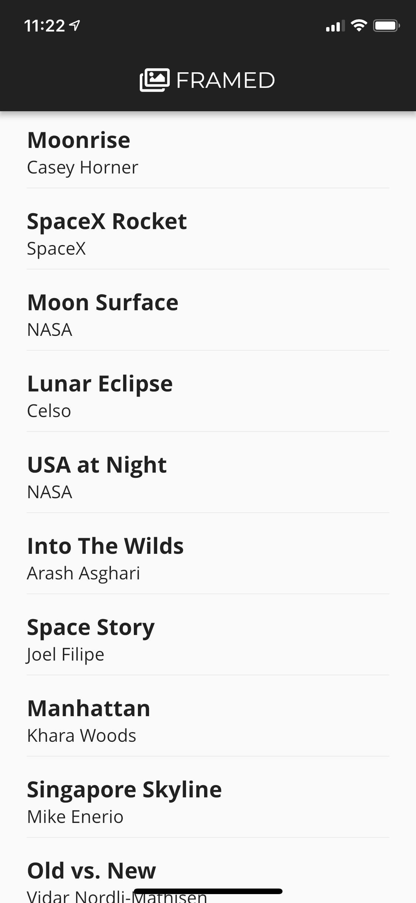

# Framed App

This is a companion app to the Framed store I created for my capstone web programming class which can be found at [framed.noahscholfield.com](https://framed.noahscholfield.com). You can also see the repository for the store [here](https://github.com/njscholfield/framed-website).

This app was built using [Flutter](https://flutter.io/) which is a framework from Google that makes it easy to develop apps for both iOS and Android using the same code. For my first Flutter app I figured I might as well add onto the store I already had.

## Screenshots

### Product List
###### The first page is a list of the products for sale on the store.

---
### Item Info
###### Clicking on one of the items brings you to a detail page.

---
### Larger Screens
###### On larger screens you can see both the list of items and an item's details at the same time.

